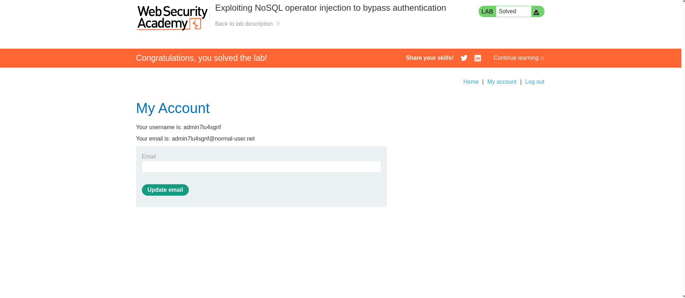

Завдання 1 (ПІДГОТОВКА)

Пройдено кімнату (https://tryhackme.com/room/sqlinjectionlm)
 

Пройдено кімнату (https://tryhackme.com/room/sqlilab)

Завдання 2 (Практика). Пройти SQLi та NoSQLi лаби та надіслати скріншоти

Лаба 1 - https://portswigger.net/web-security/nosql-injection/lab-nosql-injection-bypass-authentication

Лаба 2 - https://portswigger.net/web-security/sql-injection/lab-login-bypass

Лаба 3 - https://portswigger.net/web-security/sql-injection/union-attacks/lab-retrieve-multiple-values-in-single-column 

Завдання 3 (ЗВІТ)
 
Лінка на док зі звітами - https://docs.google.com/document/d/1hUpiIFvgaTMbou0kL6n2_E4GKZBOjHAmLbRBfC0lxPY/edit?usp=sharing